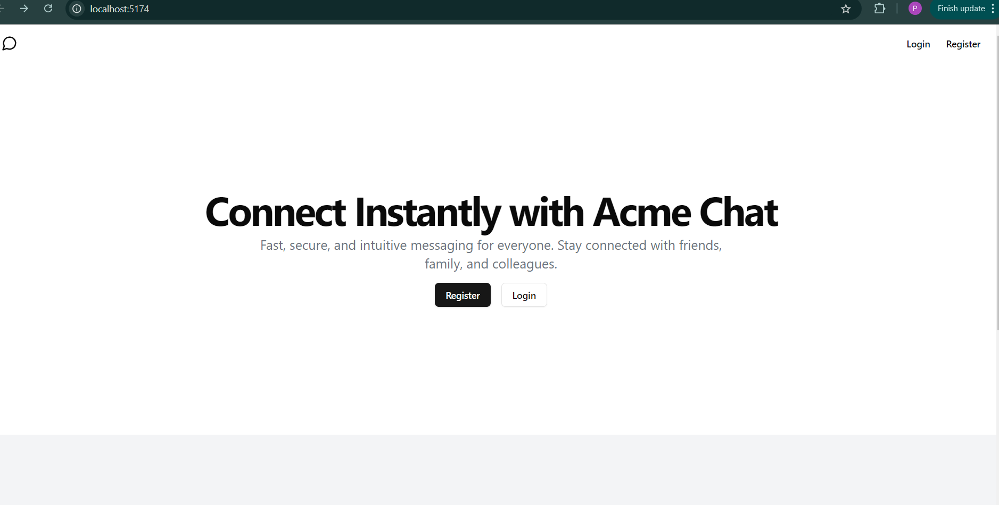

**Name** : Priyanshu  Vishwakarma
**Institute**: IIT, (BHU) Varanasi

Home Page

 
Register page

 
Sign In Page

Chats Page

The schema design of my database is 

### API Endpoints

-- **`POST /auth/register`**: Create a new user account using email, username, and password.
- **`POST /auth/login`**: Authenticate an existing user and return a JWT token for session management.
- **`GET /auth/users`**: Get a list of all users, excluding the one currently authenticated (JWT required).
- **`POST /messages`**: Send a message from the authenticated user to another user (JWT required).
- **`GET /messages/{otherUserId}`**: Retrieve the conversation history between the authenticated user and a specified user (JWT required).

For the Frontend I have used `react` with `vite` and for routing i have used `react-router-dom`, the frontend code is made with `@shadcn/ui` components and is available in the `client` folder.
